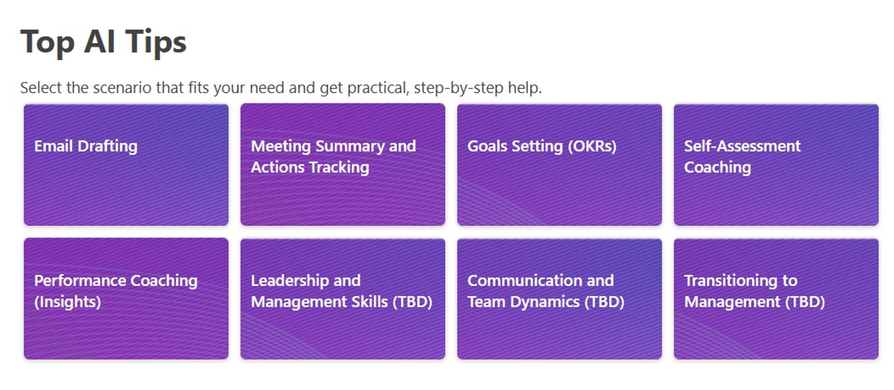

# Clickable Tiles (buttons)
## Summary
This is a SharePoint Gallery redesign with multiple clickable tiles (buttons).

## View requirements

|Type               |Internal Name|Required|
|-------------------|-------------|:------:|
|Hyperlink          |Link         |Yes     |
|Image              |Thumbnails   |Yes     |

*Notes: 
- Background images can be adjusted, sample one added to the assets folder.
- You need to use the Gallery View.

## Sample

Solution|Author(s)
--------|---------
clickable_tiles.json | [Sophie Goldstein]([https://github.com/tecchan1107](https://github.com/Sophiegold)))

## Version history

Version |Date              |Comments
--------|------------------|--------------------------------
1.0     |July 29, 2025     |Initial release

## Disclaimer
**THIS CODE IS PROVIDED *AS IS* WITHOUT WARRANTY OF ANY KIND, EITHER EXPRESS OR IMPLIED, INCLUDING ANY IMPLIED WARRANTIES OF FITNESS FOR A PARTICULAR PURPOSE, MERCHANTABILITY, OR NON-INFRINGEMENT.**

